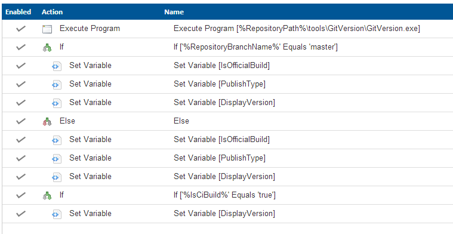
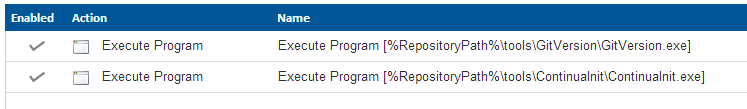

ContinuaInit
============

ContinuaInit initializes several variables in a configuration for you. This console application will automatically integrate with Continua CI and set several variables based on the current context.

This application assumes you are using GitFlow.

One of the things one should always do is to try and mainsteam all the configurations so one knows what is happening for each product. However, then you will end up doing a lot of if/else to determine the state of a build:

The advantage of these variables is that one can implement logic inside a configuration based on whether the build is a CI build and whether it is an official build. The goal of ContinuaInit was to replace this whole tree by a single call to an executable that contains rules to determine variables and init them all. This results in a much cleaner initialization.

## Usage

The usage is simple:

    ContinuaInitializer.exe -b [branchname] -v [version] -ci [true|false]

## Variables being set

    Note that if a variable is not found, Continua CI will ignore them

###PublishType

If the branch is *master*, the PublishType will be set to *Official*. Otherwise the PublishType will be set to *Nightly*.

###IsOfficialBuild

*true* if the branch *master*, otherwise *false* 

###IsCiBuild

*true* if the branch does not equal *master*, otherwise *false*

###DisplayVersion

Will be set to the version provided by the command line. Then it will apply one of the following values:

*nightly* => when nightly build

*ci* => when CI build 

#Extending rules

We do accept pull requests. The rules can be implemented by derriving from *RuleBase*. Make sure to write unit tests for new rules, then the software will always behave as expected.

#Icon

Flask by Mark Caron from The Noun Project